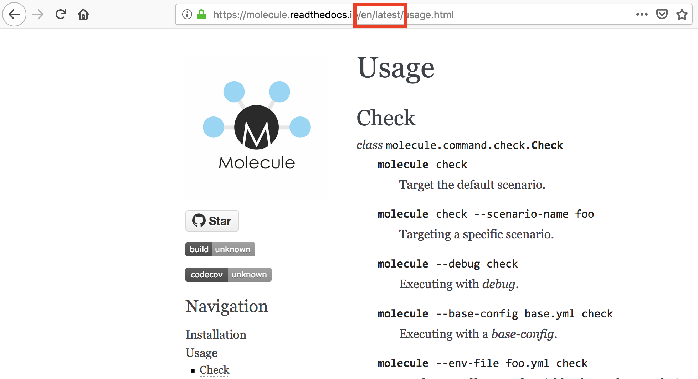
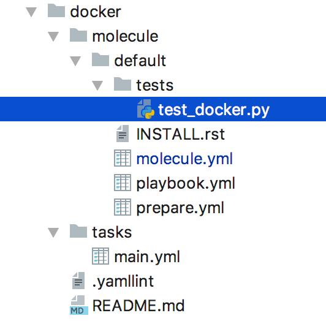
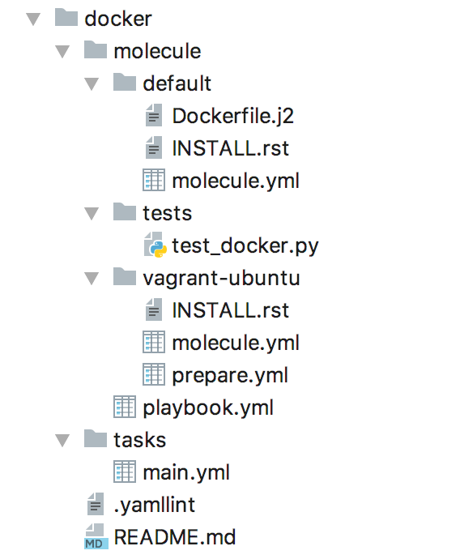
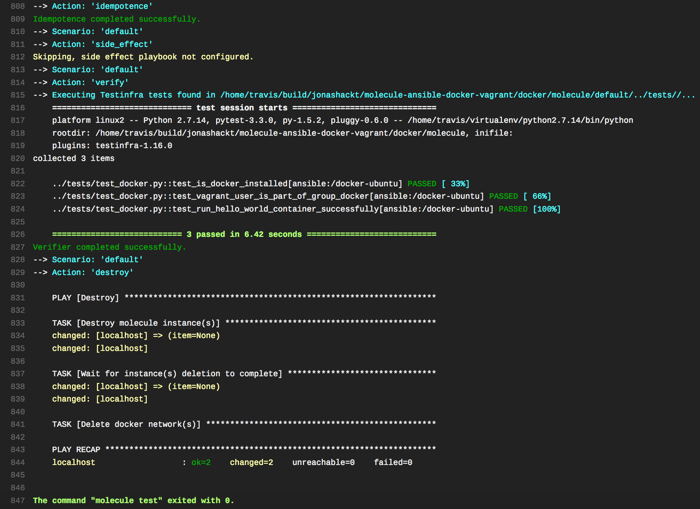

# molecule-ansible-docker-vagrant
[](https://travis-ci.org/jonashackt/molecule-ansible-docker-vagrant)

Example project showing how to test Ansible roles with Molecule using Testinfra and a multiscenario approach with Docker & Vagrant as infrastructure 

[](https://asciinema.org/a/213350)

## TDD for Infrastructure code with Molecule!

[Molecule](https://molecule.readthedocs.io/en/latest/#) seems to be a pretty neat TDD framework for testing Infrastructur-as-Code using Ansible. Molecule executes the following steps:


In the `Then` phase Molecule executes different [Verifiers](https://molecule.readthedocs.io/en/latest/configuration.html#verifier), one of them is [Testinfra](https://testinfra.readthedocs.io/en/latest/), where you can write Unittest with a Python DSL. 

> Beware of old links to v1 of Molecule! As I followed blog posts that were just from a year or two ago, I walked into the trap of using Molecule v1. This is especially problematic if you try to install Molecule via `homebrew` where you currently also get the v1 version. So always double check, if there´s no `/v1/` in the docs´ url:



Just start here: [Molecule docs](https://molecule.readthedocs.io/en/latest/configuration.html)


## Prerequisites

* `brew install ansible`
* `brew cask install virtualbox`
* `brew cask install vagrant`

> Please don´t install molecule with homebrew on Mac, but always with pip since you only get old versions and need to manually install testinfra, ansible, flake8 and other packages
* `pip install molecule --user`

> For using Vagrant with Molecule we also need `python-vagrant` module installed
* `pip install python-vagrant`


## Project structure

To initialize a new Molecule powered Ansible role named `docker` with the Vagrant driver and the Testinfra verifier you have to execute the following command:

`molecule init role --driver-name vagrant --role-name docker --verifier-name testinfra`

This will give:

`--> Initializing role docker...
 Successfully initialized new role in /Users/jonashecht/dev/molecule-ansible-vagrant/docker.`

Molecule introduces a well known project structure (at least for a Java developer like me):



As you may notice the role standard directory `tasks` is now accompanied by a `tests` directory inside the `molecule` folder where the Testinfra testcases reside.

This repository uses [a Ansible role](docker/tasks/main.yml) that installs Docker into an Ubuntu Box:

```yaml
- name: add Docker apt key
  apt_key:
    url: https://download.docker.com/linux/ubuntu/gpg
    id: 9DC858229FC7DD38854AE2D88D81803C0EBFCD88
    state: present
  ignore_errors: true

- name: add docker apt repo
  apt_repository:
    repo: "deb [arch=amd64] https://download.docker.com/linux/ubuntu {{ ansible_lsb.codename }} stable"
    update_cache: yes
  become: true

- name: install Docker apt package
  apt:
    pkg: docker-ce
    state: latest
    update_cache: yes
  become: true

- name: add vagrant user to docker group.
  user:
    name: vagrant
    groups: docker
    append: yes
  become: true
```

With Testinfra we can assert on things we want to achieve with our Ansible role: Install the `docker` package and add the user `vagrant` to the group `docker`. Testinfra uses [pytest](https://docs.pytest.org/en/latest/example/index.html) to execute the tests. Our testcases could be found in [test_docker.py](docker/molecule/tests/test_docker.py):

```python
import testinfra.utils.ansible_runner

testinfra_hosts = testinfra.utils.ansible_runner.AnsibleRunner(
    '.molecule/ansible_inventory').get_hosts('all')


def test_is_docker_installed(host):
    package_docker = host.package('docker-ce')

    assert package_docker.is_installed


def test_vagrant_user_is_part_of_group_docker(host):
    user_vagrant = host.user('vagrant')

    assert 'docker' in user_vagrant.groups
    
```

## Molecule configuration

The [molecule.yml](docker/molecule/vagrant-ubuntu/molecule.yml) configures Molecule:

```
dependency:
  name: galaxy
driver:
  name: vagrant
  provider:
    name: virtualbox
lint:
  name: yamllint
platforms:
  - name: ubuntu-docker
    box: ubuntu/bionic64
    memory: 512
    cpus: 1
    provider_raw_config_args:
    - "customize [ 'modifyvm', :id, '--uartmode1', 'disconnected' ]"
provisioner:
  name: ansible
  lint:
    name: ansible-lint
ansible:
  playbook: playbook.yml
  group_vars:
    all:
      ansible_python_interpreter: /usr/bin/python3
      ansible_user: vagrant
      ansible_ssh_private_key_file: .vagrant/machines/ubuntu-docker/virtualbox/private_key
scenario:
  name: default
verifier:
  name: testinfra
  env:
    # get rid of the DeprecationWarning messages of third-party libs,
    # see https://docs.pytest.org/en/latest/warnings.html#deprecationwarning-and-pendingdeprecationwarning
    PYTHONWARNINGS: "ignore:.*U.*mode is deprecated:DeprecationWarning"
  lint:
    name: flake8
  options:
    # show which tests where executed in test output
    v: 1
```

We have two specialties here. First thing is the follow addition to the `platforms` key:

```
    provider_raw_config_args:
    - "customize [ 'modifyvm', :id, '--uartmode1', 'disconnected' ]"
```

Without this configuration Molecule isn´t able to spin up "standard" Vagrant Ubuntu boxes like `ubuntu/bionic64` and `ubuntu/xenial64`. If you do a `tail -f /var/folders/5p/l1cc1kqd69n_qxrftgln7xdm0000gn/T/molecule/docker/default/vagrant-ubuntu-docker.err`, you see errors like this:

```
There was an error while executing `VBoxManage`, a CLI used by Vagrant
for controlling VirtualBox. The command and stderr is shown below.

Command: ["startvm", "64c5ca1e-0f7c-4dea-bc07-8144a56a0029", "--type", "headless"]

Stderr: VBoxManage: error: RawFile#0 failed to create the raw output file /usr/local/lib/python2.7/site-packages/molecule/provisioner/ansible/playbooks/vagrant/ubuntu-bionic-18.04-cloudimg-console.log (VERR_ACCESS_DENIED)
```

This is a workaround until https://github.com/ansible/molecule/issues/1556 gets fixed. This shouldn´t be necessary to be configured.

The second thing is `PYTHONWARNINGS: "ignore:.*U.*mode is deprecated:DeprecationWarning"` environment variable definition. If you don´t configure this you´ll end up with bloated test logs like this:


If you use the `PYTHONWARNINGS` environment variable you gather beautiful and __green__ test executions:


In case everything runs green you may notice that there´s is no hint which tests were executed. But I think that´s rather a pity since we want to see our whole test suite executed. That was the whole point why we even started to use a testing framework like Molecule!

But luckily there´s a way to get those tests shown inside our output. As Molecule uses [Testinfra](https://testinfra.readthedocs.io/en/latest/invocation.html) which itself leverages [pytest](https://docs.pytest.org/en/latest/) to execute our test cases and Testinfra is able to invoke pytest with additional properties. And pytest has [many options we can experiment with](https://docs.pytest.org/en/latest/reference.html#configuration-options). To configure a more verbose output for our tests in Molecule, add the following to the `verifier` section of your `molecule.yml`:

```
verifier:
  name: testinfra
...
  options:
    # show which tests where executed in test output
    v: 1
...
```

If we now execute a `molecule verify` we should see a much nicer overview of which test cases where executed:


## Execute Molecule
 
Now we´re able to run our first test. Go into `docker` directory and run:

`molecule test`

As Molecule has different phases, you can also explicitely run `molecule verify` or `molecule converge` - the commands will recognice required upstream phases like `create` and skips them if they where already run before (e.g. if the Vagrant Box is running already).


## Multi-Scenario Molecule setup

With Molecule we could not only test our Ansible roles against one infrastructure setup - but we can use multiple of them! We only need to leverage the power of [Molecule scenarios](https://molecule.readthedocs.io/en/latest/configuration.html#scenario).

To get an idea on how this works I sligthly restructured the repository. We started out with the Vagrant driver / scenario. Now after also implementing a Docker driver in this repository on it´s own: https://github.com/jonashackt/molecule-ansible-docker I integrated it into this repository.

And because Docker is the default Molecule driver for testing Ansible roles I changed the name of the Vagrant scenario to `vagrant-ubuntu`. This enables us to use `molecule test` as we´re used to, which will execute the Docker (e.g. `default`) scenario. This change results in the following project structure:



To execute the `vagrant-ubuntu` Scenario you have to explicitely call it´s name:

```
molecule test --scenario-name vagrant-ubuntu
```

[](https://asciinema.org/a/213352)

All the files which belong only to a certain scenario are placed inside the scenarios directory. For example in the Docker scenario this is `Dockerfile.js` and in Vagrant one this is `prepare.yml`. Also the `molecule.yml` files have to access the `playbook.yml` and the testfiles differently since they are now separate from the scenario directory to be [able to reuse them over all scenarios](https://molecule.readthedocs.io/en/latest/examples.html#sharing-across-scenarios):

```
...
provisioner:
  name: ansible
...
  playbooks:
    converge: ../playbook.yml
...
verifier:
  name: testinfra
  directory: ../tests/
...
```

Now we can also integrate & use TravisCI in this repository since the [default scenario Docker is supported on Travis](https://molecule.readthedocs.io/en/latest/testing.html#travis-ci)! :)




## Ubuntu based Docker-in-Docker builds

As we don´t have a Vagrant environment in a Cloud CI system available for us right now (see https://github.com/jonashackt/vagrant-ansible-on-appveyor), we should be enable us somehow to test our Ansible role only with the Docker driver.

The standard Docker-in-Docker image provided by Docker Inc is based on Alpine Linux (see https://stackoverflow.com/a/53459483/4964553 & the `dind` tags in https://hub.docker.com/_/docker/). But our role is designed for Ubuntu and thus uses the `apt` package manager instead of `apk`. So we can´t use the standard Docker-in-Docker image.

But there should be a way to do Docker-in-Docker installation with a Ubuntu base image like `ubuntu:bionic`! And there is :) 

Let´s assume the [standard Ubuntu Docker installation](https://docs.docker.com/install/linux/docker-ce/ubuntu/#install-docker-ce-1) our starting point. Everything described there is done inside our Ansible role under test __docker__ inside the playbook [docker/tasks/main.yml](docker/tasks/main.yml).

All the extra steps needed to install Docker inside a Ubuntu Docker container will be handled inside the `prepare` step. Therefore we´ll use [Molecules´ prepare.yml playbook](https://molecule.readthedocs.io/en/latest/configuration.html#id12):

> The prepare playbook executes actions which bring the system to a given state prior to converge. It is executed after create, and only once for the duration of the instances life. This can be used to bring instances into a particular state, prior to testing.


#### Configure a custom prepare step
 
The Docker-in-Docker build is only used ([and should only be used](https://jpetazzo.github.io/2015/09/03/do-not-use-docker-in-docker-for-ci/)) inside our CI pipeline. The `prepare` step inside our Molecule test suites´s `default` Docker scenario will be only executed for testing purposes.
 
So let´s configure our `default` Docker scenario to use a `prepare.yml` which could be done inside the `molecule.yml`:

```yaml
...
  playbooks:
    prepare: prepare-docker-in-docker.yml
    converge: ../playbook.yml
...
```


#### Docker-in-Docker with ubuntu:bionic

Now we should have a look into the [prepare-docker-in-docker.yml](docker/molecule/default/prepare-docker-in-docker.yml):

```yaml
# Prepare things only necessary in Ubuntu Docker-in-Docker scenario
- name: Prepare
  hosts: all
  tasks:
    - name: install gpg package
      apt:
        pkg: gpg
        state: latest
        update_cache: true
      become: true

    # We need to anticipate the installation of Docker before the role execution...
    - name: add Docker apt key
      apt_key:
        url: https://download.docker.com/linux/ubuntu/gpg
        id: 9DC858229FC7DD38854AE2D88D81803C0EBFCD88
        state: present
      ignore_errors: true

    - name: add docker apt repo
      apt_repository:
        repo: "deb [arch=amd64] https://download.docker.com/linux/ubuntu {{ ansible_lsb.codename }} stable"
        update_cache: yes
      become: true

    - name: install Docker apt package
      apt:
        pkg: docker-ce
        state: latest
        update_cache: yes
      become: true

    - name: create /etc/docker
      file:
        state: directory
        path: /etc/docker

    - name: set storage-driver to vfs via daemon.json
      copy:
        content: |
          {
            "storage-driver": "vfs"
          }
        dest: /etc/docker/daemon.json

    # ...since we need to start Docker in a complete different way
    - name: start Docker daemon inside container see https://stackoverflow.com/a/43088716/4964553
      shell: "/usr/bin/dockerd -H unix:///var/run/docker.sock > dockerd.log 2>&1 &"
```

As the `ubuntu:bionic` Docker image is sligthly stripped down compared to a "real" Ubuntu virtual machine, we need to install the `gpg` package at first.

Then really being able to run Docker-in-Docker we need to do three things:

1. Run Docker with `--priviledged` (which should really only be used inside our CI environment, because it grant´s full access to the host environment (see https://hub.docker.com/_/docker/))
2. Use the [storage-driver `vfs`](https://docs.docker.com/storage/storagedriver/vfs-driver/#configure-docker-with-the-vfs-storage-driver), which is slow & inefficient but is the only one guaranteed to work regardless of underlying filesystems
3. Start the Docker daemon with `/usr/bin/dockerd -H unix:///var/run/docker.sock > dockerd.log 2>&1 &`, or otherwise you´ll run into errors like `Cannot connect to the Docker daemon at unix:///var/run/docker.sock. Is the docker daemon running?` (see https://stackoverflow.com/a/43088716/4964553)

You may noticed that __2.__ & __3.__ are handled by our `prepare-docker-in-docker.yml` already. To enable the __1.__ `--priviledged` mode we need to configure Molecules´ Docker driver inside the `molecule.yml`:

```yaml
...
driver:
  name: docker
platforms:
  - name: docker-ubuntu
    image: ubuntu:bionic
    privileged: true
...
```

#### Testing the Docker-in-Docker installation

The last step - or the first, if you leverage the power of Test-Driven-Development (TDD) - was to create a suitable testcase. This test should verify whether the Docker-in-Docker installation was successful.

Therefore we can use the [hello-world](https://hub.docker.com/_/hello-world/) Docker image. Let´s execute a `docker run hello-world` straight inside our test case `test_run_hello_world_container_successfully` in our test suite [test_docker.py](docker/molecule/tests/test_docker.py):

```
def test_run_hello_world_container_successfully(host):
    hello_world_ran = host.run("docker run hello-world")

    assert 'Hello from Docker!' in hello_world_ran.stdout
```

This will verify that

1. the Docker client is able to contact the Docker daemon
2. the Docker daemon successfully pulled the image `hello-world` from the Docker Hub
3. the Docker daemon created a new container from that image and runs the executable inside
4. the Docker daemon streamed the executables output containing `Hello from Docker!` to the Docker client, which send it to the terminal


## Testinfra code examples

As you´re not an in-depth Python hacker (like me), you´ll be maybe also interested in example code. Have a look at:

https://github.com/philpep/testinfra#quick-start

https://github.com/openmicroscopy/ansible-role-prometheus/blob/0.2.0/tests/test_default.py

https://github.com/mongrelion/ansible-role-docker/blob/master/molecule/default/tests/test_default.py