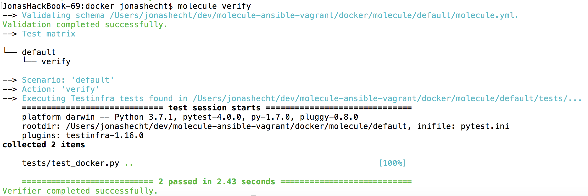

# molecule-ansible-vagrant
Example project showing how to test Ansible roles with Molecule and Vagrant

### TDD for Infrastructure code with Molecule!

[Molecule](https://molecule.readthedocs.io/en/latest/#) seems to be a pretty neat TDD framework for testing Infrastructur-as-Code using Ansible. Molecule executes the following steps:


In the `Then` phase Molecule executes different [Verifiers](https://molecule.readthedocs.io/en/latest/configuration.html#verifier), one of them is [Testinfra](https://testinfra.readthedocs.io/en/latest/), where you can write Unittest with a Python DSL. 

> Beware of old links to v1 of Molecule! As I followed blog posts that were just from a year or two ago, I walked into the trap of using Molecule v1. This is especially problematic if you try to install Molecule via `homebrew` where you currently also get the v1 version. So always double check, if there´s no `/v1/` in the docs´ url:


Just start here: [Molecule docs](https://molecule.readthedocs.io/en/latest/configuration.html)


### Prerequisites

* `brew install ansible`
* `brew cask install virtualbox`
* `brew cask install vagrant`

> Please don´t install molecule with homebrew on Mac, but always with pip since you only get old versions and need to manually install testinfra, ansible, flake8 and other packages
* `pip install molecule --user`

> For using Vagrant with Molecule we also need `python-vagrant` module installed
* `pip install python-vagrant`


### Project structure

To initialize a new Molecule powered Ansible role named `docker` with the Vagrant driver and the Testinfra verifier you have to execute the following command:

`molecule init role --driver-name vagrant --role-name docker --verifier-name testinfra`

This will give:

`--> Initializing role docker...
 Successfully initialized new role in /Users/jonashecht/dev/molecule-ansible-vagrant/docker.`

Molecule introduces a well known project structure (at least for a Java developer like me):


As you may notice the role standard directory `tasks` is now accompanied by a `tests` directory inside the `molecule` folder where the Testinfra testcases reside.

This repository uses [a Ansible role](docker/tasks/main.yml) that installs Docker into an Ubuntu Box:

```yaml
- name: add Docker apt key
  apt_key:
    url: https://download.docker.com/linux/ubuntu/gpg
    id: 9DC858229FC7DD38854AE2D88D81803C0EBFCD88
    state: present
  ignore_errors: true

- name: add docker apt repo
  apt_repository:
    repo: "deb [arch=amd64] https://download.docker.com/linux/ubuntu {{ ansible_lsb.codename }} stable"
    update_cache: yes
  become: true

- name: install Docker apt package
  apt:
    pkg: docker-ce
    state: latest
    update_cache: yes
  become: true

- name: add vagrant user to docker group.
  user:
    name: vagrant
    groups: docker
    append: yes
  become: true
```

With Testinfra we can assert on things we want to achieve with our Ansible role: Install the `docker` package and add the user `vagrant` to the group `docker`. Our testcases could be found in [test_docker.py](docker/tests/test_docker.py):

```python
import testinfra.utils.ansible_runner

testinfra_hosts = testinfra.utils.ansible_runner.AnsibleRunner(
    '.molecule/ansible_inventory').get_hosts('all')


def test_is_docker_installed(host):
    package_docker = host.package('docker-ce')

    assert package_docker.is_installed


def test_vagrant_user_is_part_of_group_docker(host):
    user_vagrant = host.user('vagrant')

    assert 'docker' in user_vagrant.groups
    
```

### Molecule configuration

The [molecule.yml](docker/molecule/default/molecule.yml) configures Molecule:

```
dependency:
  name: galaxy
driver:
  name: vagrant
  provider:
    name: virtualbox
lint:
  name: yamllint
platforms:
  - name: ubuntu-docker
    box: ubuntu/bionic64
    memory: 512
    cpus: 1
    provider_raw_config_args:
    - "customize [ 'modifyvm', :id, '--uartmode1', 'disconnected' ]"
provisioner:
  name: ansible
  lint:
    name: ansible-lint
ansible:
  playbook: playbook.yml
  group_vars:
    all:
      ansible_python_interpreter: /usr/bin/python3
      ansible_user: vagrant
      ansible_ssh_private_key_file: .vagrant/machines/ubuntu-docker/virtualbox/private_key
scenario:
  name: default
verifier:
  name: testinfra
  env:
    # get rid of the DeprecationWarning messages of third-party libs,
    # see https://docs.pytest.org/en/latest/warnings.html#deprecationwarning-and-pendingdeprecationwarning
    PYTHONWARNINGS: "ignore:.*U.*mode is deprecated:DeprecationWarning"
  lint:
    name: flake8
```

We have two specialties here. First thing is the follow addition to the `platforms` key:

```
    provider_raw_config_args:
    - "customize [ 'modifyvm', :id, '--uartmode1', 'disconnected' ]"
```

Without this configuration Molecule isn´t able to spin up "standard" Vagrant Ubuntu boxes like `ubuntu/bionic64` and `ubuntu/xenial64`. If you do a `tail -f /var/folders/5p/l1cc1kqd69n_qxrftgln7xdm0000gn/T/molecule/docker/default/vagrant-ubuntu-docker.err`, you see errors like this:

```
There was an error while executing `VBoxManage`, a CLI used by Vagrant
for controlling VirtualBox. The command and stderr is shown below.

Command: ["startvm", "64c5ca1e-0f7c-4dea-bc07-8144a56a0029", "--type", "headless"]

Stderr: VBoxManage: error: RawFile#0 failed to create the raw output file /usr/local/lib/python2.7/site-packages/molecule/provisioner/ansible/playbooks/vagrant/ubuntu-bionic-18.04-cloudimg-console.log (VERR_ACCESS_DENIED)
```

This is a workaround until https://github.com/ansible/molecule/issues/1556 gets fixed. This shouldn´t be necessary to be configured.

The second thing is `PYTHONWARNINGS: "ignore:.*U.*mode is deprecated:DeprecationWarning"` environment variable definition. If you don´t configure this you´ll end up with bloated test logs like this:


If you use the `PYTHONWARNINGS` environment variable you gather beautiful and __green__ test executions:




### Execute Molecule
 
Now we´re able to run our first test. Go into `docker` directory and run:

`molecule verify`

As Molecule has different phases, you can also explicitely run `molecule destroy` or `molecule converge` - the commands will recognice required upstream phases like `create` and skips them if they where already run before (e.g. if the Vagrant Box is running already).